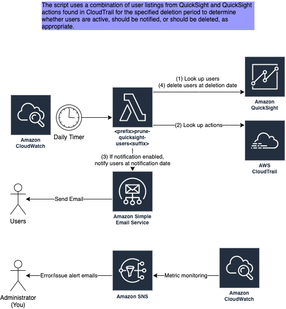

# QuickSight User Cleanup

https://github.com/StateFarmIns/terraform-aws-quicksight-user-pruning

# Overview

QuickSight behaves differently than many other AWS services. When you log in to the AWS console, Your account isn't charged. Your account is only charged for usage.

Not so in the QuickSight console. When you login, you are asked for your e-mail address. Upon submitting, you create yourself as an author. Your account is charged [$24/month](https://aws.amazon.com/quicksight/pricing/) in perpetuity.

This results in a gradual upward trend in QuickSight costs. For example, here are actual costs for the past year taken from one of our AWS accounts:


In August of 2021, we implemented automatic user pruning with this Terraform module. Costs dropped precipitously. Not only that, but users were able to scale up/down as needed, and costs would adjust accordingly rather than continue to increase.

After deploying this module, you will have a Lambda that runs daily (or on a schedule of your choosing -- but keep in mind it is designed to run daily with the way notifications are designed). The Lambda compares CloudTrail events to current QuickSight users. It notifies users when they haven't been used for exactly 30 days (by default) and deletes them when they haven't been used in 45 or more days (by default). This will save you big chunks of money. No underlying resources are touched (yet). If a user makes a dashboard and that user is deleted, then it makes no difference. Other users with access still have access, and the original user may regain access by logging in again.

# Prerequisites

1. QuickSight should be enabled in the AWS account. This module provides cost-savings benefits to QuickSight and is not useful if you don't have QuickSight enabled in your account.
1. Your account must not be in sandbox mode for SES (Simple Email Service). [Learn how to identify and remove sandbox mode here](https://docs.aws.amazon.com/ses/latest/DeveloperGuide/request-production-access.html)

# Diagram

[](docs/diagram.png)

# Consumption

## Usage Example

```hcl
provider "aws" {
  default_tags {
    tags = {
      contact      = "EMAIL"
      cost-id      = "COMPONENT"
      workgroup    = "WORKGROUP"
      product-name = "PRODUCT_NAME"
      repo         = "YOUR_REPO"
    }
  }
}

module "quicksight-user-pruning" {
    # Either source from Terraform Registry, or source from the github repo directly
    # source = "git::https://github.com/StateFarmIns/terraform-aws-quicksight-user-pruning.git?ref=<FIND LATEST REPO TAG>"
    # or use below 2 lines

  source  = "StateFarmIns/quicksight-user-pruning/aws"
  version = "<FIND LATEST REPO TAG>"

  contact_email = "YOUR_DL"
  cc            = ["SOMEONE@youremail.com", "SOMEONE_ELSE@youremail.com"]
  reply_to      = "SOMEONE@youremail.com"
}
```

## Monitoring

The module does not create any CloudWatch Alarms to alert you of issues. You must do this on your own.

The example below creates the following alarms:

- Errors > 0 (5 minute interval)
- Invocations < 1 for a period of 24 hours
- Throttles > 0 (5 minute interval)
- Invalid Users > 0 (5 minute interval)

```hcl
locals {
  team_emails = ["my.email@youremail.com", "your.email@youremail.com"]
}

resource "aws_sns_topic" "team_alerts" {
  name = "<YOUR TEAM NAME>-team-alerts"
  tags = { cloudwatch_alarm = "encryption_disabled" }
}

resource "null_resource" "subscribe_team_alerts" {
  count = length(local.team_emails)
  provisioner "local-exec" {
    command = "aws sns subscribe --topic-arn ${aws_sns_topic.team_alerts.arn} --protocol email --notification-endpoint ${local.team_emails[count.index]} --region ${local.region}"
  }
}

resource "aws_cloudwatch_metric_alarm" "pruneQuickSightUsers_errors" {
  alarm_name          = "${module.pruneQuickSightUsers.lambda_name}-errors"
  comparison_operator = "GreaterThanThreshold"
  evaluation_periods  = "1"
  metric_name         = "Errors"
  namespace           = "AWS/Lambda"
  period              = "300"
  statistic           = "Sum"
  threshold           = 0
  alarm_description   = "Errors occurred invoking the lambda."
  treat_missing_data  = "notBreaching"
  alarm_actions       = [aws_sns_topic.team_alerts.arn]

  dimensions = {
    FunctionName = module.pruneQuickSightUsers.lambda_name
  }
}

resource "aws_cloudwatch_metric_alarm" "pruneQuickSightUsers_throttles" {
  alarm_name          = "${module.pruneQuickSightUsers.lambda_name}-throttles"
  comparison_operator = "GreaterThanThreshold"
  evaluation_periods  = "1"
  metric_name         = "Throttles"
  namespace           = "AWS/Lambda"
  period              = "300"
  statistic           = "Maximum"
  threshold           = 0
  alarm_description   = "The Lambda has been throttled."
  treat_missing_data  = "notBreaching"
  alarm_actions       = [aws_sns_topic.team_alerts.arn]

  dimensions = {
    FunctionName = module.pruneQuickSightUsers.lambda_name
  }
}

resource "aws_cloudwatch_metric_alarm" "pruneQuickSightUsers_no_invocations" {
  alarm_name          = "${module.pruneQuickSightUsers.lambda_name}-no-invocations"
  comparison_operator = "LessThanThreshold"
  evaluation_periods  = "1"
  metric_name         = "Invocations"
  namespace           = "AWS/Lambda"
  period              = (60 * 60 * 24) # 24 hours
  statistic           = "Maximum"
  threshold           = 1
  alarm_description   = "The Lambda has not been invoked in the last 24 hours."
  treat_missing_data  = "notBreaching"
  alarm_actions       = [aws_sns_topic.team_alerts.arn]

  dimensions = {
    FunctionName = module.pruneQuickSightUsers.lambda_name
  }
}

resource "aws_cloudwatch_metric_alarm" "pruneQuickSightUsers_invalid_users" {
  alarm_name          = "${module.pruneQuickSightUsers.lambda_name}-invalid-users"
  comparison_operator = "GreaterThanThreshold"
  evaluation_periods  = "1"
  metric_name         = "InvalidUsersCount"
  namespace           = module.pruneQuickSightUsers.lambda_name
  period              = "300"
  statistic           = "Sum"
  threshold           = 0
  alarm_description   = "Invalid users with N/A usernames are present in the account. These users will need to be deleted manually."
  treat_missing_data  = "notBreaching"
  alarm_actions       = [aws_sns_topic.team_alerts.arn]
}
```

## Sample Dashboard

Below is the source for a sample CloudWatch Dashboard that shows the money saved by this script and the actions taken by the script.


```
{
    "widgets": [
        {
            "type": "metric",
            "x": 0,
            "y": 9,
            "width": 24,
            "height": 6,
            "properties": {
                "metrics": [
                    [ "prefix-quicksight-user-cleanup", "NotificationsSentCount" ]
                ],
                "view": "timeSeries",
                "stacked": true,
                "region": "us-east-1",
                "stat": "Sum",
                "period": 86400,
                "liveData": true,
                "legend": {
                    "position": "bottom"
                },
                "title": "E-mail notifications sent by day"
            }
        },
        {
            "type": "metric",
            "x": 0,
            "y": 3,
            "width": 24,
            "height": 6,
            "properties": {
                "metrics": [
                    [ "prefix-quicksight-user-cleanup", "UsersDeletedCount" ]
                ],
                "view": "timeSeries",
                "stacked": true,
                "region": "us-east-1",
                "stat": "Sum",
                "period": 86400,
                "title": "Users deleted by day",
                "liveData": true
            }
        },
        {
            "type": "metric",
            "x": 0,
            "y": 15,
            "width": 24,
            "height": 6,
            "properties": {
                "metrics": [
                    [ "prefix-quicksight-user-cleanup", "RemainingQuickSightUsersCount" ],
                    [ ".", "PriorQuickSightUsersCount" ]
                ],
                "view": "timeSeries",
                "stacked": false,
                "region": "us-east-1",
                "stat": "Average",
                "period": 86400,
                "liveData": true,
                "title": "Count of QuickSight users by day"
            }
        },
        {
            "type": "metric",
            "x": 6,
            "y": 0,
            "width": 6,
            "height": 3,
            "properties": {
                "metrics": [
                    [ "prefix-quicksight-user-cleanup", "RemainingQuickSightUsersCount" ]
                ],
                "view": "singleValue",
                "region": "us-east-1",
                "stat": "Maximum",
                "period": 86400,
                "title": "QS users after today's run",
                "liveData": false
            }
        },
        {
            "type": "metric",
            "x": 0,
            "y": 0,
            "width": 6,
            "height": 3,
            "properties": {
                "metrics": [
                    [ "prefix-quicksight-user-cleanup", "PriorQuickSightUsersCount" ]
                ],
                "view": "singleValue",
                "region": "us-east-1",
                "stat": "Maximum",
                "period": 86400,
                "title": "QS users before today's run"
            }
        },
        {
            "type": "metric",
            "x": 12,
            "y": 0,
            "width": 3,
            "height": 3,
            "properties": {
                "metrics": [
                    [ { "expression": "m1*24", "label": "$ Saved This Month", "id": "e1", "region": "us-east-1" } ],
                    [ "prefix-quicksight-user-cleanup", "UsersDeletedCount", { "id": "m1", "visible": false } ]
                ],
                "view": "singleValue",
                "region": "us-east-1",
                "stat": "Sum",
                "period": 2592000,
                "title": "Saved $"
            }
        },
        {
            "type": "metric",
            "x": 15,
            "y": 0,
            "width": 3,
            "height": 3,
            "properties": {
                "metrics": [
                    [ { "expression": "m1*24", "label": "Current Users Monthly $", "id": "e1", "region": "us-east-1" } ],
                    [ "prefix-quicksight-user-cleanup", "RemainingQuickSightUsersCount", { "id": "m1", "visible": false } ]
                ],
                "view": "singleValue",
                "region": "us-east-1",
                "stat": "Maximum",
                "period": 86400,
                "title": "User $"
            }
        }
    ]
}
```

Note: Change `prefix-` to your prefix.
